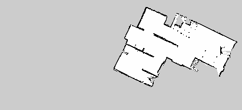
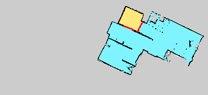
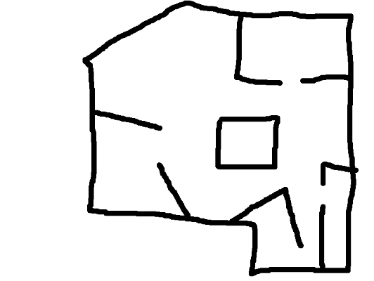

//Numering of sections
:sectnums:
:sectnumlevels: 5

= Raptors Barrier Generator Algorithm
---

The overall goal of this algorithm is to take unprocessed image of map and convert
it into regions that robot cannot access.

== Input data

=== Imaga data

Image consists of 3 types of pixels:

* [black]#*Black pixels*# - representing walls
* [gray]#*Gray pixels*# - representing area outside of building boundary
* [white]#*White pixels*# - respresenting area which robot can move

=== Robot's starting position

IMPORTANT: Because of the fact that robot will be not able to enter specific positions,
*accessible positions always depend on starting point*.

Suppose we example presented on image below where we have 2 areas that have been returned from algorithm.
From one we cannot pass to the other. In this case if robot starts in [yellow]#*yellow region*# it will be able to move only in yellow regions.
It is analogical with [blue]#*blue regions*#.

=== Robot shape information

IMPORTANT: The assumption at this point is that we take the largest width of robot as the shape information

== Extraction of boundaries between accessible and inaccessible part

=== Problems and motivations

Due to the fact that input image is not in perfect condition we need to make clear division between impassable part
and the part that can be accessed by robot.

This problem is at the outer boundary of image. Boundary of outer image can currently have 2 forms. The former is between black and white parts,
whereas the latter is between gray and white regions

Furthermore the additional problem solved to local file by this module are small holes in black boundary.

=== Solution and output

The solution involves using usage of multiple filters both to fill small holes and extract boundary.
It can be accessed in link:../src/map_processing/map_processing.py[following location].

The *output image* contains of:

* *Black pixels* - represent boundaries
* [white]#*White pixels*# - respresenting other regions than boundaries

== Smart Brute Force

=== Problems and motivations

This algorithm takes previously prepared map with extracted boundaries and transforms them straight to polygonized components representing regions that can and cannot be accessed by robot.

=== Solution and output

Before entering solution we extend boundaries by the radious of robot, those are regions that the robot won't be able to access

Solution can be summarized as put robot in given starting position then extract region that it can pass through by moving in all directions.
Then spawn model in other non-boundary or already visitied locations and start extracting impassable regions from there.

It can be accessed in link:../src/barrier_generator/smart_brute_force/smart_brute_force.py[following location].

The *output* consists of single region that robot can pass and multple impassable regions, each of them being represented as list of polygons.

NOTE: Single region can be represented by multiple polygons cause of innerings

=== Technical details

WARNING: This is coupled with current implementation (may be outdated)

Algorithm steps

* Thicken boundaries - so that every boundary gets additional area, which is the one that robot won't be able to enter (too close to boundary)
* Generation of regions
* Generate passable region, at which robot started and the robot can move through (on by on untill no possible regions), then poygonizes them in final solution.

== Vectorized Analysis Algorithm

NOTE: This is alternative to Smart Brute Force with better performance

WARNING: Due to muliple step and higher complexity (including parameterization need) this solution was abandoned. It will be about 2x faster.

=== Extracting polygons

==== Motivation

Polygons will be much easier to work with and are required for finding regions with current algorithm.

==== Output

Because boundaries have non-zero width we have to include 2 additional concepts, which are *inner and outer boundaries*.
That part of algorithm returns all polygons with their inner and outer boundaries *as polygons*.

=== Finding lines that robot won't be able to pass

==== Problems and motiviations

This is the key problem of the algorithm to find places which actually the robot won't be able to pass though.

==== Detection of impassable lines based on polygonized boundaries

==== Ouput

=== Finding regions that robot won't be access from one another

==== Segmentation
The solution used currently extracts segmentation map based on Felzenszwalb algorithm.

==== Merging of small regions

Because of the fact that segmentation may leave some small regions additional mergin needs to be done

==== Final merging based on intial position of robot
Final merging collects all regions that are not the one in which robot can move into larger ones and polygonizes those.

==== Ouput
The output of the module is the polygonized boundaries of all separate regions that cannot be accessed based on given starting point position.

## Developers guide

### Using algorithm API
The facade is defined link:../src/api/barrier_generation_controller[here]

Example use case can be seen in link:../tests/test_barrier_generation.py[test_api() test]

### Tuneable parameters
WARNING: Solution have parameters which effect working of the algorithm (some may need to be parameterized)

Here is list of most important parameters:

* *MapProcessing : black_pixel_threshold* - defines when pixel is turned into passable or inpassabl area (after blurring)

Assumption parameters (should not be change)

* * *SmartBruteForce : NOT_CHECKED,PASSABLE,BLOCKED,BOUNDARY* - values for pixels represeting target state
